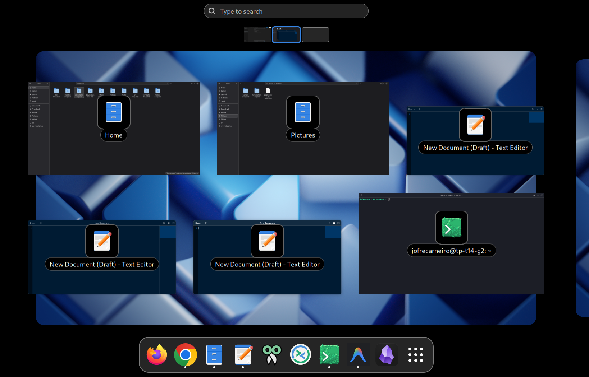
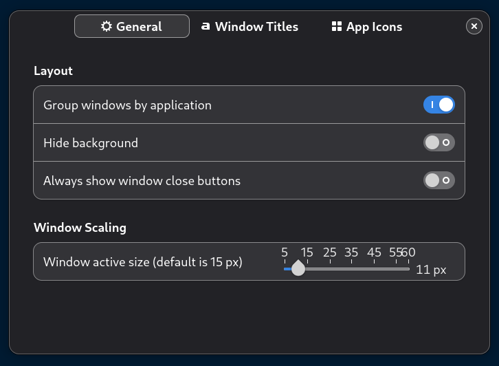

# Always-Show-Titles-In-Overview

This a GNOME Shell extension that customizes the Overview by always showing titles on window thumbnails, grouping windows by application chronologically, and allowing advanced configurations like adjusting icon/title positions and hiding the background.

  

## Overview

## Why I wrote this extension
Please read this post ([Gnome 3.26: How to get the window titles in the activities view back?](https://www.reddit.com/r/gnome/comments/7dk1kb/gnome_326_how_to_get_the_window_titles_in_the/))
and this comment below [Gnome Bugzilla - Window picker layout improvements](https://bugzilla.gnome.org/show_bug.cgi?id=783953).

## Features
| Features                                                             | Default Setting |
|----------------------------------------------------------------------|-----------------|
| Always show titles of all window thumbnails                          | -               |
| Group windows by application (Chronological grouping)                | on              |
| Always show close buttons of all window thumbnails                   | off             |
| Window titles position (Bottom, Center)                              | Bottom          |
| Move window titles to the bottom when fullscreen                     | on              |
| Move window titles to the bottom for video/TV players                | on              |
| Show app icons                                                       | on              |
| App icon position (Bottom, Center)                                   | Bottom          |
| Hide icons when fullscreen                                           | on              |
| Hide icons for Video/TV players                                      | on              |
| Tweak the window thumbnail active size increment (from 5 to 60 px)   | 15              |
| Hide the overview background                                         | off             |

## GNOME versions

| GNOME version   | Branch          | Is default branch? |
|-----------------|-----------------|--------------------|
| GNOME 40 to 44  |  [gnome-40-44](https://github.com/nlpsuge/Always-Show-Titles-In-Overview/tree/gnome-40-44)  | No  |
| GNOME 45+       |  [main](https://github.com/jofre-pecege/Always-Show-Titles-In-Overview/tree/main)      | Yes |

## Settings
This extension features a fully modernized tabbed settings interface using Libadwaita primitives (AdwPreferencesWindow).

